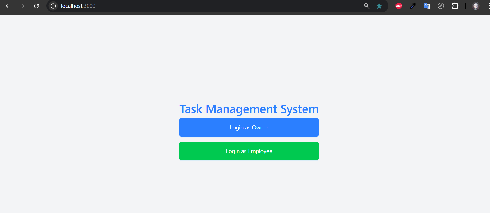
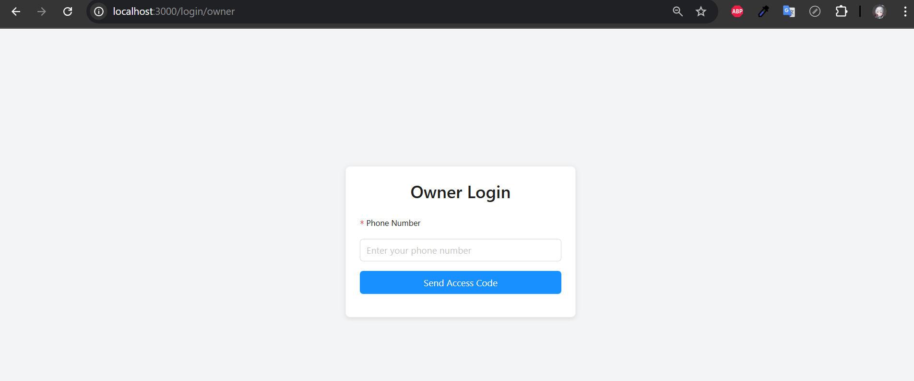
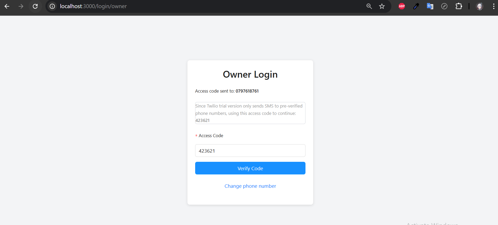
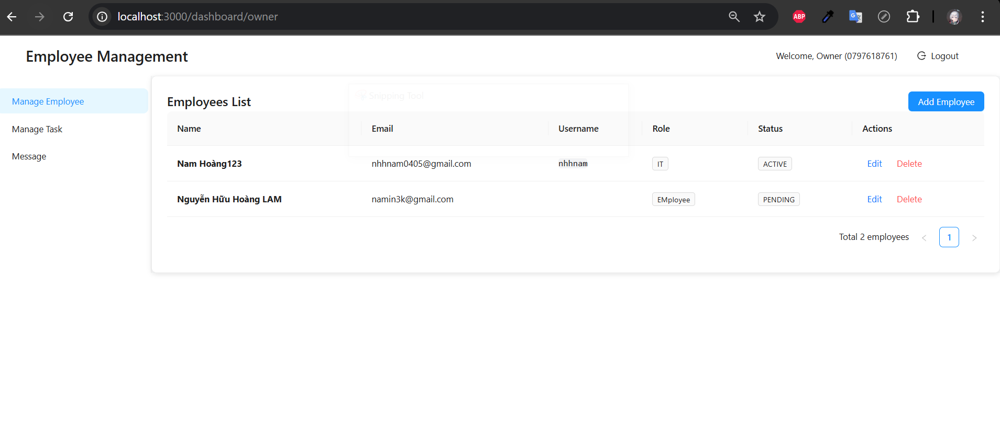

Structure:

challenge_fe/  
├── public/  
├── src/  
│ ├── app/  
│ │ ├── dashboard/  
│ │ │ ├── owner/  
│ │ │ │ └── message/  
│ │ │ └── employee/  
│ │ └── account-setup/  
│ ├── components/  
│ │ ├── Chat/  
│ │ ├── Owner/  
│ │ └── Employee/  
│ ├── hooks/  
│ ├── services/  
│ └── contexts/  
├── package.json  
├── next.config.mjs  
├── jsconfig.json  
└── README.md

- src/app/\*\*: Next.js app directory, organizes all pages and routing logic for the application
- src/components/\*\*: Reusable React components for UI, split by feature/domain
- src/hooks/\*\*: Custom React hooks for encapsulating logic
- src/utils/\*\*: Logic that share for the entire project
- src/services/\*\*: Contains API and socket logic, split by domain
- src/contexts/\*\*: React context providers for global state management (e.g., AuthContext for authentication)
- public/\*\*: Static assets (images, icons, screenshots) served directly by Next.js

Setup & Run

1. git clone <link>
2. npm install
3. Configure environment variables  
   You have to create the .env file yourself(same level with src folder)  
   Then fill this env value into the file:

   NEXT_PUBLIC_API_BASE_URL='http://localhost:5000'

4. Start the server  
   For development: npm run dev  
   For production(for better experience):  
    npm run build  
    npm run start

Screenshots

Landing Page  

## Owner

Owner Login  

Verify Access Code

Employee Management Page

Notes

- Make sure your backend server is running and accessible at the API URL specified in your `.env`.
